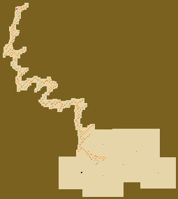

# arpg-map-gen
- Rust arpg procedural map generation
- Each pixel is a game tile

### Main generation steps
- "Shoot" a point that will create overlaping rectangles in a semi random way, based on parameters (see floor_patterns module)
- "Smooth out" the generated area by removing small tiles clusters, and rounding corners
- Resize the area to useful tiles only
- Map out the external layout of the map as a polygon, for later use to fence the player in the map, without using all tiles.

### Example outputs

A forest

An island

A quary ledge

A desert

